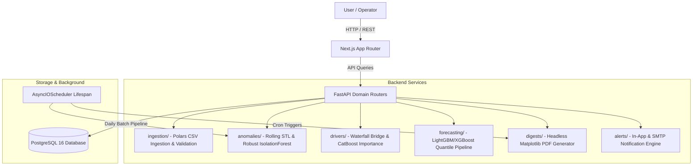

<!-- Source: hackforge-analyze | Confidence: [STRONG] | Version: v2 | Checkpoint: analyze-complete | Dependencies: none -->
# Blueprint: Driftline

## Metadata
- **Type:** PRODUCT
- **Domain:** Time-series anomaly detection, root-cause driver analysis, and short-horizon forecasting for business metrics
- **Cultural Context:** default
- **Generated:** 2026-07-24-133500

## Problem Statement
Business operations and revenue data streams (e.g. daily revenue, MRR, user churn) suffer from silent anomalies and unexpected volatility. Existing enterprise observability platforms require data teams and complex SQL modeling, while simple dashboard tools offer static alert rules (missing trend shifts or volatility spikes) and black-box predictive widgets lacking root-cause dimensional context.

Driftline provides an automated platform that:
1. Ingests multi-dimensional daily time series data using Polars for high-speed validation and date-gap detection.
2. Decomposes time-series into full historical trend, seasonal, and residual components ($y_t = T_t + S_t + R_t$).
3. Detects anomalies via dual-signal robust z-scores (MAD) and scikit-learn IsolationForest scoring, classified into Spikes, Dips, Level Shifts, and Volatility shifts.
4. Performs root-cause driver analysis using a zero-leakage Waterfall Bridge and CatBoost structural feature importance.
5. Provides multi-quantile forecasting ($p_{10}, p_{50}, p_{90}$) using LightGBM and XGBoost with quantile rearrangement non-crossing guarantees.
6. Delivers automated weekly PDF digests via headless Matplotlib and same-day alert notifications following each scheduled batch run.

## User Goal Mapping
- **What changes for the user**: Founders, growth leads, and ops managers transition from reactive incident troubleshooting to instant root-cause clarity and calibrated 30-day forecast projections without writing SQL or relying on a dedicated data team.
- **Displaced habits**: Manual SQL grouping queries, static spreadsheet baseline calculations, and uncalibrated threshold alerts.

## Target Users
- **Primary**: Founders, growth/ops leads, and RevOps operators at small-to-midsize SaaS or e-commerce teams who don't have a dedicated data analyst — needing instant anomaly detection and root-cause driver analysis without writing SQL queries.
- **Secondary**: Financial Operations leads managing core business revenue KPIs across multidimensional breakdown segments (e.g., channel, plan, region).

## Architecture
### Pattern: Modular Monolith (FastAPI Backend + Next.js App Router Frontend)
### System Design

### Component Breakdown
- `src/ingestion`: Polars CSV parsing, date gap detection, dimension inference, Polars-to-Pandas dictionary handoff at DB boundary, observation storage.
- `src/anomalies`: Continuous calendar reindexing, 28-day rolling trend/seasonal decomposition, Median Absolute Deviation z-score calculation, scikit-learn IsolationForest scoring, 14-day history freezing, and weight decay feedback loop.
- `src/drivers`: Part A Waterfall Bridge calculating exact segment contribution deltas $\sum_s \Delta_s = \Delta_{\text{total}}$, Part B CatBoostRegressor structural feature importance with nested savepoint transaction safety.
- `src/forecasting`: Trailing-only feature engineering (`.shift(1)`), LightGBM/XGBoost $p_{10}, p_{50}, p_{90}$ quantile regression, non-crossing rearrangement, segment reconciliation, and 12-week walk-forward backtesting.
- `src/digests`: Headless Matplotlib PDF digest generator (`matplotlib.use('Agg')`), automated APScheduler lifespan jobs, REST download endpoint.
- `src/alerts`: Anti-join alert evaluation query, multi-channel notification engine (in-app notifications, isolated SMTP email dispatch).

### Data Architecture: SQL (PostgreSQL 16 with asyncpg)
- Relational schema with JSONB support for dynamic dimensional keys (`dimension_values`).
- Indexed date queries: composite indexes on `(metric_id, date)` across `observations`, `daily_rollups`, `anomalies`, `forecasts`.

### Real-Time / Execution Cadence: Daily Scheduled Batch Runs
- APScheduler triggers the daily pipeline batch run at 02:00 UTC and weekly retraining & digest generation at 03:00 UTC on Mondays. Same-day notifications fire immediately following each completed daily batch run.

## Tech Stack
| Layer | Choice | Version | Why | Alternative | Confidence |
|---|---|---|---|---|---|
| Backend Framework | FastAPI | 0.115+ | Async REST performance, OpenAPI documentation | Django / Flask | [STRONG] |
| DB Engine & ORM | PostgreSQL + SQLAlchemy 2.0 | 2.0+ | Declarative async mappings, JSONB support | Asyncpg raw | [STRONG] |
| Migrations | Alembic | 1.14+ | Idempotent PostgreSQL ENUM & table schema evolution | Prisma | [STRONG] |
| Data Ingestion | Polars | 1.20+ | Lightning-fast CSV loading, validation & inference | Pandas | [STRONG] |
| Stats & ML | Pandas + scikit-learn | 2.2+ / 1.6+ | Time-series rolling windows, IsolationForest | Statsmodels | [STRONG] |
| Driver Importance | CatBoost | 1.2+ | Native categorical feature importance without manual encoding | XGBoost | [STRONG] |
| Forecasting | LightGBM + XGBoost | 4.5+ / 2.1+ | Fast quantile regression ($p_{10}, p_{50}, p_{90}$) | Prophet | [STRONG] |
| Visualizations | Plotly + Altair | 5.24+ / 5.5+ | Interactive frontend charts + server-side Vega-Lite spec | Chart.js | [STRONG] |
| PDF Generator | Matplotlib (headless) | 3.10+ | Clean static vector graph rendering to PDF | WeasyPrint | [STRONG] |
| Frontend | Next.js (App Router) + TS | 15+ / 5.7+ | Server-side rendering, React 19, TypeScript type safety | Vite + React | [STRONG] |
| Styling | Tailwind CSS | 3.4+ | Utility-first responsive design system | Vanilla CSS | [STRONG] |

## Innovation Differentiators
1. **Mathematical Invariant Guarantees**: Complete DB persistence with strict tests asserting mathematical invariants ($\sum_s \Delta_s = \Delta_{\text{total}}$, $p_{10} \le p_{50} \le p_{90}$, $\text{trend} + \text{seasonal} + \text{residual} = \text{actual}$).
2. **Quantile Uncertainty & Segment Reconciliation**: Reconciled segment quantile forecasts that preserve raw uncertainty half-widths while matching total median forecasts.
3. **Weight Decay Feedback Loop**: User feedback on false positive anomalies automatically decays signal weights and updates past non-frozen anomaly severity scores.

## Build Order (Sequenced)
1. Ingestion Pipeline (`src/ingestion/`) — CSV parsing, validation, date gap detection.
2. Time Series Decomposition & Daily Rollups (`src/anomalies/service.py`).
3. Anomaly Detection & Feedback Loop (`src/anomalies/`).
4. Root-Cause Driver Analysis & CatBoost (`src/drivers/`).
5. Quantile Forecasting & Walk-Forward Backtesting (`src/forecasting/`).
6. PDF Digest Generation & Alert Dispatch (`src/digests/`, `src/alerts/`).
7. Next.js Frontend Dashboards (`frontend/`).

## Risk Assessment
| Risk | Likelihood | Mitigation |
|---|---|---|
| Look-ahead leakage in forecasting | Low | Feature engineering uses explicit `.shift(1)` before rolling window calculations |
| CatBoost training transaction abort | Low | Wrapped in `async with db.begin_nested():` savepoint isolation |
| Quantile crossing ($p_{10} > p_{50}$) | Low | `enforce_quantile_non_crossing` applies quantile sorting rearrangement |

## Kill Conditions
- If walk-forward backtest MAPE exceeds 15.0% on 2-year synthetic evaluation dataset.
- If anomaly detection recall drops below 75.0% on ground-truth benchmark.
