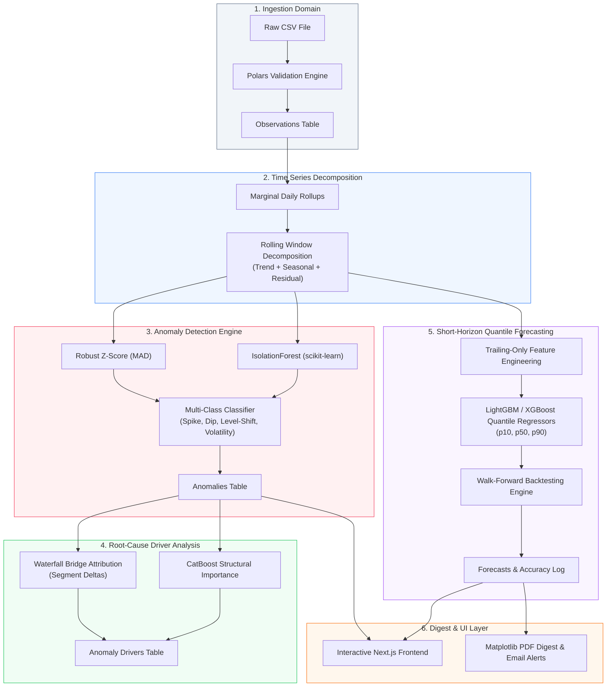
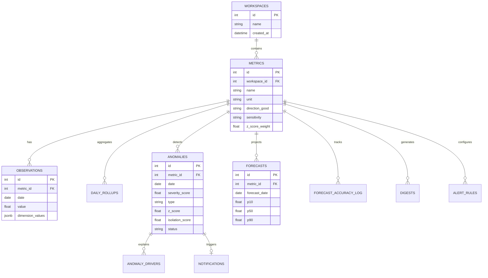

# Driftline

**Driftline** is an automated anomaly detection, root-cause driver analysis, and short-horizon forecasting engine built for business metrics with up to 3 categorical dimensions (e.g. daily MRR by channel, plan, and region). It automatically ingests multi-dimensional time series, decomposes historical baseline trends, identifies anomalous fluctuations, isolates root-cause segment drivers via waterfall bridges and CatBoost models, and generates quantile forecasts ($p_{10}, p_{50}, p_{90}$) with walk-forward backtest calibration.

---

## 1. The Problem Driftline Solves

Modern revenue and business operations teams face a critical market gap:
- **Simple Topline Rules Fail**: Basic threshold alerts on total revenue miss segment-level anomalies (e.g. an Enterprise churn drop masked by a Paid channel promotional spike) or trigger false alarms on routine day-of-week seasonality.
- **Heavy Enterprise ML Tools Overcomplicate**: Heavy observability suites require complex data pipelines, dedicated data science teams, and lengthy onboarding without providing actionable segment-level driver breakdowns.

**Driftline bridges this gap**: It provides a lightweight, self-contained system operating on a single business metric with categorical dimensions. It delivers automated decomposition, hybrid multivariate anomaly detection, exact mathematical waterfall attribution, quantile forecasting, and automated PDF executive digests out of the box.

---

## 2. Architecture Overview

Driftline follows a domain-module architecture where every pipeline stage persists its output to PostgreSQL.

### End-to-End ML Pipeline Data Flow



### Database Entity-Relationship (ER) Diagram



---

## 3. Getting Started (Run Locally in Under 15 Minutes)

### Option A: Running with Docker Compose (Recommended)

Requires Docker Desktop or Docker Engine.

```bash
# 1. Clone the repository
git clone https://github.com/Tejas3479/driftline.git
cd driftline

# 2. Launch the entire stack (PostgreSQL + FastAPI Backend + Next.js Frontend)
docker compose up --build -d

# 3. Generate the synthetic 2-year MRR dataset inside the container
docker compose exec backend python scripts/generate_synthetic_data.py

# 4. Open the application in your browser
# URL: http://localhost:3000
```

Once the UI loads at `http://localhost:3000`:
1. Click **Upload CSV** in the top navigation bar.
2. Select the generated file `demo_data/synthetic_mrr.csv` from your local workspace directory.
3. Review the Polars validation report and click **Confirm & Ingest**.
4. Explore all 7 UI screens loaded with end-to-end data!

> **Note on Email Alerts**: If SMTP credentials are not configured in `.env`, email alerts log a warning and skip dispatch gracefully while preserving in-app notifications.

---

### Option B: Local Host Development Setup

Requirements: Python 3.11+, Node.js 20+, PostgreSQL 16.

```bash
# 1. Start PostgreSQL database (e.g. via Docker)
docker compose up -d db

# 2. Setup Python virtual environment
python -m venv .venv
source .venv/bin/activate  # On Windows: .venv\Scripts\activate
pip install -r requirements.txt

# 3. Run database migrations
alembic upgrade head

# 4. Start FastAPI backend server
uvicorn main:app --reload --port 8000

# 5. In a second terminal, start Next.js frontend
cd frontend
npm install
npm run dev

# Frontend runs at http://localhost:3000 | Backend runs at http://localhost:8000
```

---

## 4. Whole-Pipeline Evaluation Benchmark

Driftline includes a rigorous end-to-end evaluation benchmark that runs the full pipeline against 2 years of synthetic data and verifies outputs against injected ground-truth anomalies.

```bash
# Generate the synthetic 2-year dataset (if not already generated)
python scripts/generate_synthetic_data.py

# Run the whole-pipeline evaluation benchmark
python scripts/evaluate_pipeline.py

# Run the complete automated test suite (49 unit & integration tests)
python -m pytest
```

### Session 18 Benchmark Results (Ground-Truth Verification)

| Metric | Measured Value | Benchmark Target | Status |
|---|---|---|---|
| `detection_recall` | **100.00%** | $\ge 75.0\%$ (4/4 GT events detected) | **PASS** |
| `classification_accuracy` | **100.00%** | $\ge 75.0\%$ correct type classification | **PASS** |
| `false_positive_rate` | **1.66%** | $\le 10.0\%$ on untouched dates | **PASS** |
| `driver_accuracy` | **100.00%** | $\ge 66.0\%$ segment match | **PASS** |
| `uniform_shift_proportionality` | **True** | $15.0\% \pm 3.0\%$ all segments | **PASS** |
| `forecast_MAPE` (12w) | **2.64%** | $\le 15.0\%$ held-out backtest | **PASS** |
| `interval_coverage` ($p_{10}\dots p_{90}$) | **92.86%** | $60.0\%\dots 95.0\%$ calibration band | **PASS** |

---

## 5. UI Screen Walkthrough (7 Core Screens)

1. **Overview Dashboard (`/`)**: Displays active metric cards with sparkline trends, current MRR values, direction indicators, anomaly counts, and quick CSV ingestion trigger.
2. **Time Series Detail Page (`/metrics/[id]`)**: Interactive Plotly time-series chart showing total value, trend decomposition, MAD confidence bands, and color-coded anomaly markers.
3. **Anomaly Detail & Root Cause Drivers (`/anomalies/[id]`)**: Deep-dive waterfall bridge chart attributing exact segment contributions to an anomaly, CatBoost structural feature importance, and alert feedback controls (`reviewed`, `false_positive`).
4. **Segment Comparison Small-Multiples (`/metrics/[id]/segments`)**: Multi-facet Vega-Lite visualization comparing marginal performance across segments (`Organic`, `Paid`, `Referral`) on a shared y-axis scale.
5. **Forecast & Track Record (`/metrics/[id]/forecast`)**: Quantile prediction chart ($p_{10}, p_{50}, p_{90}$) projected into the future, alongside a 12-week walk-forward backtesting track record comparing historical predictions vs actuals.
6. **Global Anomaly Log (`/anomalies`)**: Unified filterable table listing all detected anomalies across metrics with status tabs (`All`, `New`, `Reviewed`, `Resolved`, `False Positive`), search filters, and severity badges.
7. **Model Health & Settings (`/settings`)**: System health dashboard displaying 12-week backtest MAPE, interval coverage calibration, ML model engine status, scheduler jobs, and metric sensitivity controls.

---

## 6. Project Structure

```
driftline/
├── alembic/              # Database migration scripts
├── demo_data/            # Synthetic CSV datasets & ground-truth specs
├── frontend/             # Next.js 14 App Router frontend
│   ├── app/              # App router pages & API client
│   └── components/       # Plotly, Vega, & UI components
├── scripts/              # Data generator & pipeline evaluation scripts
├── src/                  # Domain-driven backend application
│   ├── alerts/           # Notification & email dispatch domain
│   ├── anomalies/        # Time-series decomposition & detection domain
│   ├── db/               # SQLAlchemy engine & session setup
│   ├── digests/          # PDF report generation & scheduler domain
│   ├── drivers/          # Root-cause waterfall bridge & CatBoost domain
│   ├── forecasting/      # LightGBM/XGBoost quantile forecasting domain
│   └── ingestion/        # Polars CSV validation & observation domain
├── tests/                # Pytest unit & integration test suite
├── docker-compose.yml    # Single-command stack orchestration
├── Dockerfile            # FastAPI backend container definition
├── main.py               # FastAPI application entrypoint
└── requirements.txt      # Python dependencies
```

---

## 7. License

MIT License. Built as part of the Driftline business metric observability platform.
